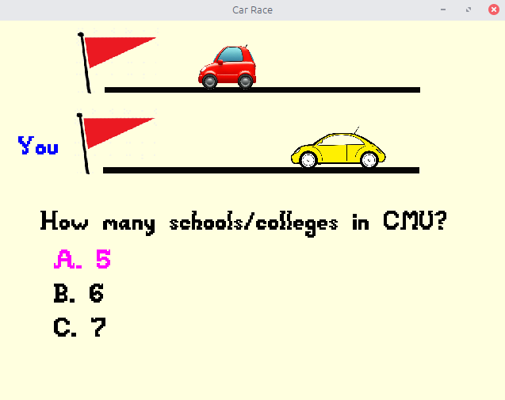

# (TODO: your game's title)

Author: (TODO: your name)

Design: (TODO: In two sentences or fewer, describe what is new and interesting about your game.)

Screen Shot:

How To Play:

(TODO: describe the controls and (if needed) goals/strategy.)

Art Sources:

(TODO: fill in information about the sources of any artwork you used in the game that you did not draw.)

This game was built with [NEST](NEST.md).

https://www.pngfind.com/mpng/bJJJhb_emoji-car-auto-automobile-vechicle-bus-red-redcar/
https://www.pngfind.com/mpng/hoxoJxR_car-bus-auto-show-volkswagen-beetle-compact-car/
https://www.pngfind.com/mpng/ioRRbw_red-flag-triangle-pennon-banner-red-triangle-flag/
